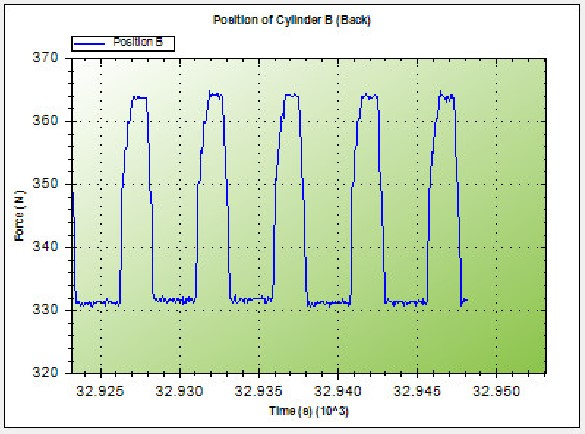

# Graduate Project
This is a mechatronics graduation project finished in August 2023. Building a control system for the Durability testing machine for office equipment using STM32
## Demo
Link youtube: https://youtu.be/vZy61SKHjCs
### Electrical Cabinet
 

### Control Panel

### Data collection C#

Force of Cylinder A

Position of Cylinder A

Force of Cylinder B

Position of Cylinder B

### Android app

